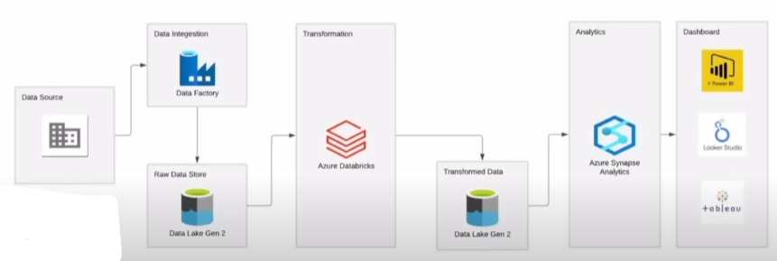

# 🏅 Tokyo Olympics 2021 — End-to-End Azure Data Engineering Project

This project demonstrates a **complete Azure-based data engineering pipeline** built to analyze the **Tokyo Olympics 2021 dataset** using modern cloud services — from **data ingestion** to **transformation, analytics, and visualization**.

---

## 🚀 Project Overview

**Goal:** To design and deploy an end-to-end data pipeline that extracts, transforms, and visualizes Olympic medal data.

**Architecture:**

---

## 🧩 Azure Services Used

| Layer | Service | Purpose |
|-------|----------|----------|
| Data Integration | **Azure Data Factory** | Automated data ingestion pipelines from GitHub |
| Data Storage | **Azure Data Lake Gen2** | Store raw and transformed data |
| Data Transformation | **Azure Databricks** | Clean and transform data using PySpark |
| Data Warehouse | **Azure Synapse Analytics** | Query transformed data using SQL |
| Visualization | **Looker Studio** | Create interactive dashboards |

---

## 📊 Looker Studio Dashboard
Link for Dahboard - https://lookerstudio.google.com/reporting/6cddceca-8767-497a-b9cd-1dbc4e8eefdb

🔗 **View Interactive Dashboard:** [Your Looker Studio Link Here]

**Insights:**
- 🥇 United States leads with 113 medals.
- 🇨🇳 China and ROC follow closely.
- 🌍 Top 10 countries account for ~60% of all medals.

---

## 🧱 Pipeline Flow
Data Source → Data Factory → Data Lake Gen2 (Raw) → Databricks → Data Lake Gen2 (Transformed) → Synapse Analytics → Looker Studio Dashboard
